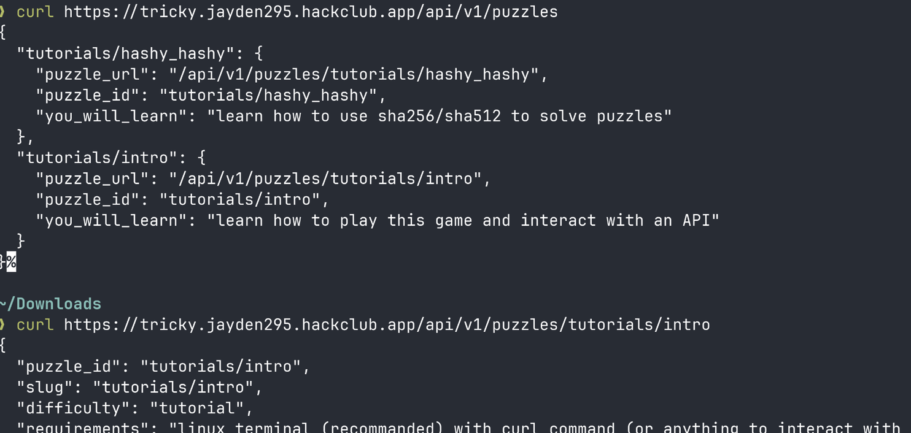

# tricky-20

This project is still under the demo/showcase phase, and
[I still have some things planned for it](TODO.md).

Tricky 20 is my attempt at making some kind of game that is playable though the
command line.

It's basically a bunch of puzzles that are fetchable though an API and can
mostly be done using the command line.

The website looks very barebones since you play the game though an API, I kind
of like the barebones aesthetic too.

You can
[get more information and play it here](https://tricky.jayden295.hackclub.app)

## Screenshots

These aren't much, since this game is mostly played though the command line.



## Development/Running it

First, you need to have a .env file (that you must **KEEP PRIVATE**), or these
variables defined in your environment.

```env
AUTH_SECRET= # for auth.js create a bunch of random characters and that's it
AUTH_DRIZZLE_URL= # database url, postgresql recommanded
AUTH_GITHUB_ID= # github oauth client id
AUTH_GITHUB_SECRET= # github oauth client secret
AUTH_GITLAB_ID= # gitlab oauth client id
AUTH_GITLAB_SECRET= # gitlab oauth secret id
```

Then, install the project dependencies though `deno install`

Setup the database by running `deno task drizzle-kit generate` and
`deno task drizzle-kit migrate`

### Development

For development, simply run `deno task dev`.

### Production

For production, run `npm run build` and `deno task preview`.

For building, you need to use npm, unfortunately astro/deno don't work very well
together, I had build failures with deno.

By default, we build it using the node.js backend as a standalone build.\
You will probably need to add HOST=0.0.0.0 for it to work.\
[Official Astro documentation for node.js builds](https://docs.astro.build/en/guides/integrations-guide/node/#standalone)

Other backends may work as well, but aren't not tested.

## Security

Please send an email to `skewed-fade-deluxe@duck.com` if you found any security
issues, I will try my best to fix them.

Emails can be encrypted using my
[gpg key](https://keys.openpgp.org/search?q=skewed-fade-deluxe%40duck.com) if
wanted.

Other contact info is availible down in
[my website](https://jayden295.codeberg.page/).

## License

This project is licensed under the [GPL-3.0-or-later](LICENSE.md) .

This program is free software: you can redistribute it and/or modify it under
the terms of the GNU General Public License as published by the Free Software
Foundation, either version 3 of the License, or (at your option) any later
version.

This program is distributed in the hope that it will be useful, but WITHOUT ANY
WARRANTY; without even the implied warranty of MERCHANTABILITY or FITNESS FOR A
PARTICULAR PURPOSE. See the GNU General Public License for more details.

You should have received a copy of the GNU General Public License along with
this program. If not, see <https://www.gnu.org/licenses/>.

## Project websites

This is not the only website made for tricky-20, here are the others:
[https://github.com/very-cool-programming-club173/website](https://github.com/very-cool-programming-club173/website)
